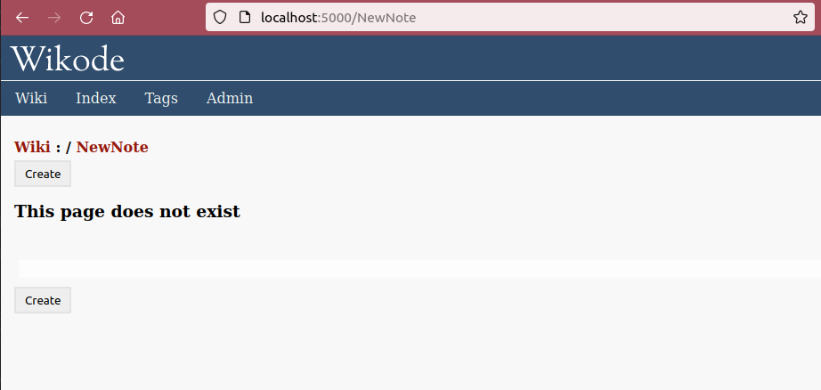
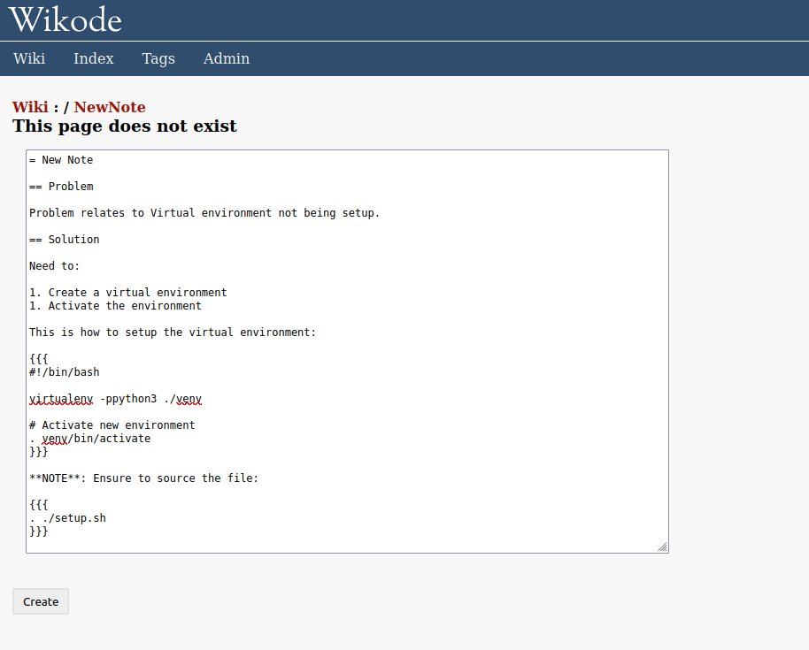
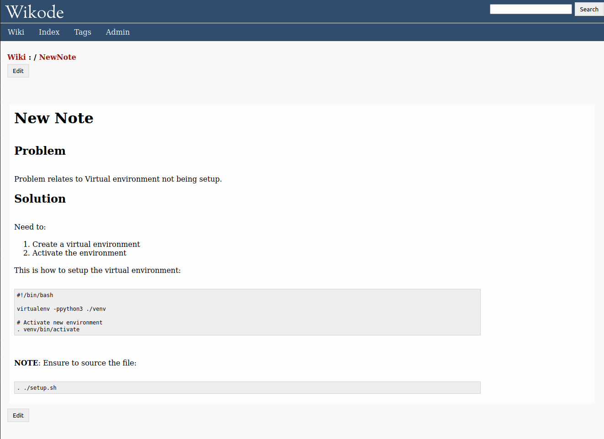
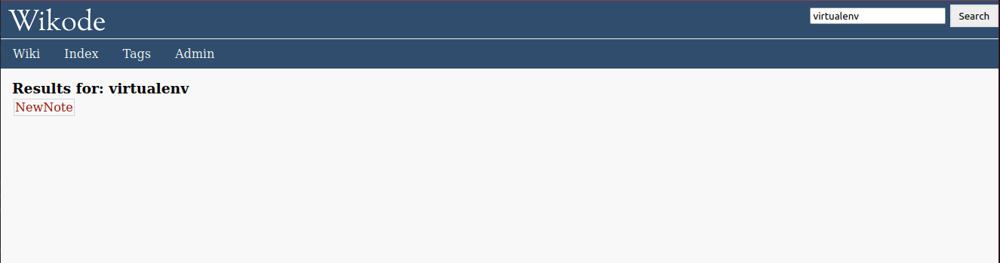

# Wikode

Simple web-based note/documentation app, built around text-based Git/SVN storage.

Provides _some_ TracWiki (moinmoin) markup and a small amount of Markdown support.

## Example

Create a new page:





Published page:



Search:




## Install

```
virtualenv .
source bin/activate
pip install -r requirements.txt
```

## Run

```
python ./run.py
```

Goto http://localhost:5000

For alternative ports, see [Configure]

## Admin page

The admin page allows:

 * the SCM configuration to be specified,
 * re-index the local SQLite database, used for search functionality

## Configure

Create config.json in root directory, following options are available:

* LISTEN_HOST
* LISTEN_PORT
* SCM_TYPE
* DATA_DIR
* SQLITE_PATH


## Macros

There are support for some macros:

### Tags

Example:
```
[[Tags(some-tag)]]
```

Add tags to a page, which are grouped together in the 'tags' page.


## WARNING

Do not push to - this is a replica from upstream https://gitlab.dockstudios.co.uk/pub/wikode
